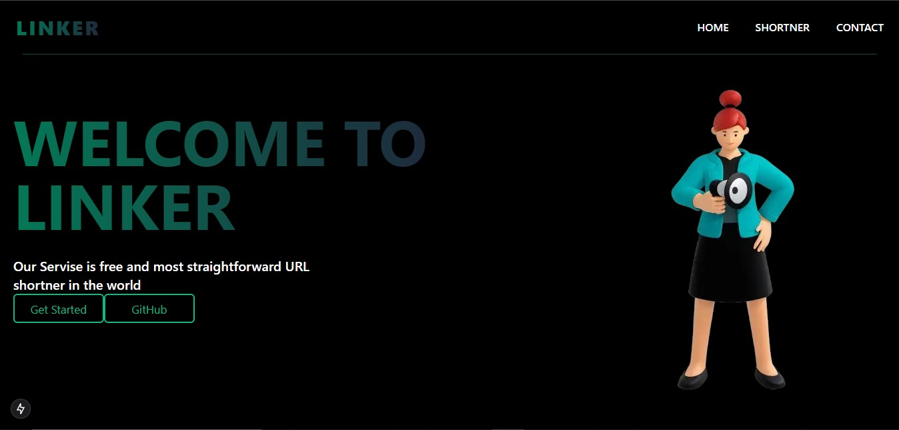
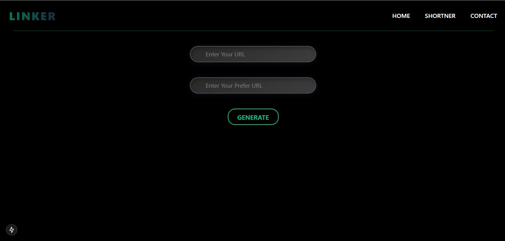

# Linker - URL Shortener Application

## About Linker

Linker is a simple and efficient URL shortener application designed to convert long, unwieldy URLs into short, manageable links. Our service provides a straightforward solution for sharing links across various platforms, making it easier to distribute and track your URLs.

## Demo Images

### Key Features:

- **Quick URL Shortening**: Convert long URLs into short, custom links with ease.
- **Custom Short URLs**: Create personalized short links for better brand recognition and memorability.
- **User-Friendly Interface**: Clean and intuitive design for effortless URL shortening.
- **Responsive Design**: Works seamlessly across desktop and mobile devices.

### Technologies Used:

- Next.js
- React
- TypeScript
- MongoDB
- Tailwind CSS
- Styled Components

## Getting Started

To run Linker locally, follow these steps:

1. Clone the repository
2. Install dependencies with `npm install`
3. Set up your MongoDB connection string in `.env.local`
4. Run the development server with `npm run dev`

Visit `http://localhost:3000` to see the application in action.

## Contributing

We welcome contributions to Linker! Please feel free to submit issues and pull requests.

## License

This project is open source and available under the [MIT License](LICENSE).
